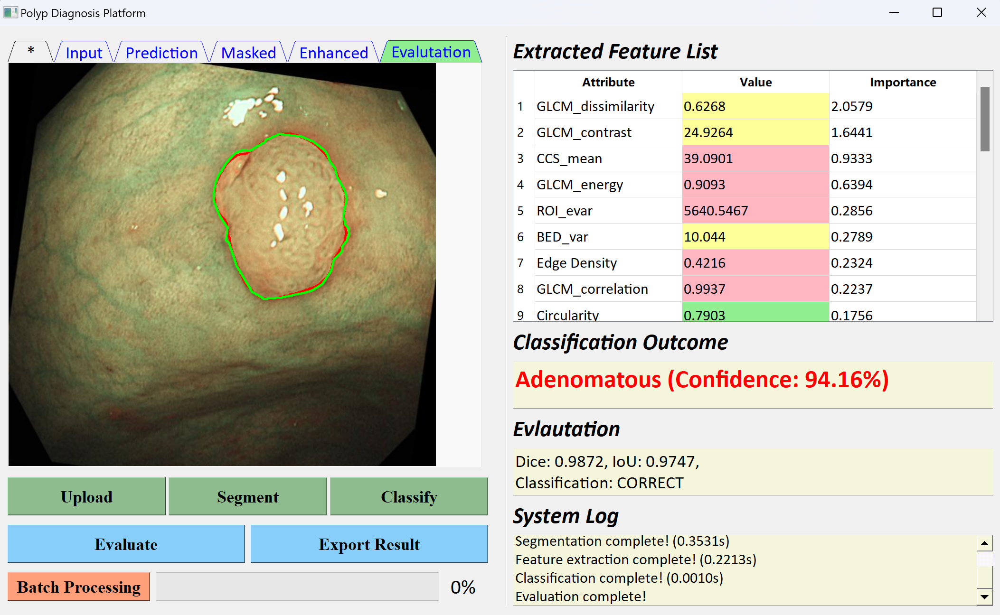

# Enhancing Medical Diagnosis using Deep-learning based Segmentation

# Author：Yang Xinchen

# Master thesis:

**(Updated on 09.09.2024)**

Final version of the complete thesis uploaded.
               

# Python project

- # The folder "[Diagnosis_Platform]([https://git.mylab.th-luebeck.de/xinchen.yang/building-management-machine-vision/-/tree/main/detection_platform](https://github.com/Myosotis1111/Polyp-diagnosis-platform/tree/main/Diagnosis_Platform))" contains all the source codes used in this master thesis.

The python project （see folder “**Diagnosis_Platform**”） is packed using conda. Users can download the folder (please make sure there is **at least 8GB** available in the disk Anaconda installed), import to IDE and follow three steps to configure the environment:

**(1) Use Conda to create a new environment**. Run the following command in a terminal or command prompt:

    conda env create -f environment.yaml

This will create a new Conda environment using the configuration in the environment.yaml file.

**(2)** After the environment is created successfully, **activate the newly created environment.** Run the following command:

    conda activate polyp_diagnosis

**(3)** Finally, **change the Python interpreter** of the program to the interpreter in the conda environment you just created. The project can then be run via **main.py**.

# NBI Dataset

The dataset used in this master thesis contains 1211 annotated NBI images and their corresponding masks for training and 120 for testing. The collection and annotation are under the instructions of colonoscopists from the Fourth People's Hospital, Shanghai, China.
